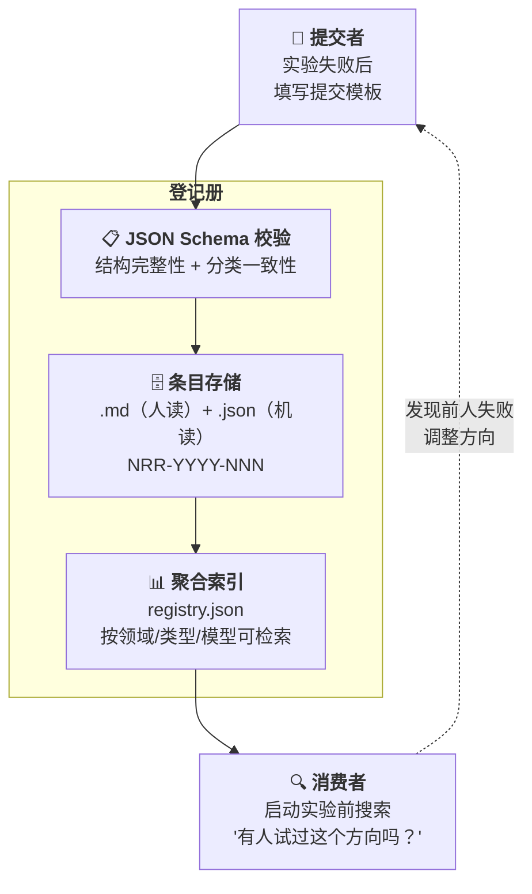

# AI 协作阴性结果登记册

> **Negative Results Registry for AI Collaboration** — 一个结构化的、可检索的"AI 实验失败了"公开登记系统。

[](https://creativecommons.org/licenses/by/4.0/)
[](https://github.com/redamancy231-create/negative-results-registry/actions/workflows/ci.yml)
[]()

[]()
[](en/README.md)
[](zh-Hant/README.md)

> **知道什么不 work 和知道什么 work 同等重要。** · [在线浏览](https://redamancy231-create.github.io/negative-results-registry/)

---

## 这是什么

科学界有一个"文件抽屉问题"（file drawer problem）：阳性结果发表，阴性结果塞进抽屉。AI 协作领域同样如此——GitHub 上充斥着"我用 AI 做了 X"的展示，但几乎没有人记录"我试了 X，失败了"。

**这个登记册旨在对抗"文件抽屉问题"。** 它是一个结构化的、可通过 `registry.json` 机器查询的公开数据库，专门记录 AI 协作中的阴性/诚实结果。当前为维护者个人失败日志的结构化原型，外部条目接入后方可声称社区价值。

### 核心信念

- **阴性结果不是失败——是数据**
- **诚实建立信任**——一个说自己"所有实验都成功"的人要么没做过实验，要么在撒谎
- **知道死胡同的位置，后来人就不会撞墙**
- **精确的失败条件比模糊的成功宣言更有信息量**
- **目前为维护者个人失败日志的结构化原型**——22 条目、同一提交者、同一生态，尚不能声称已"对抗文件抽屉问题"；需外部提交和独立条目后才能作为社区登记册

---

## 为什么是我来做

GitHub 上有 1,800 万 AI 相关仓库，其中绝大多数是代码项目——"我用 AI 做了 X"的展示。做一个新工具、新框架、新模型，你一搜能找到几十个竞品。

**但这个登记册不是代码项目。** 它是一套结构化的方法论数据——22 个条目背后是跨 5 种 LLM 后端、覆盖多个公开项目的独立审查经验。仅 AI 协作框架一个项目就累积了 50+ 轮独立审查，加上其他项目的审查链，总轮次从未统计但远超此数。每个条目中的具体数字（d=0.03, n=24/臂, 33 项发现 0 重叠）都有源文件和审查链可追溯，不是在真空中编造的。

**差异化不在代码，在经验密度。** 别人可以 fork 这个仓库、复制 Schema、改个名字发布——但写不出条目里的数据。代码可以复制，经验不能。

---



---

## 分类体系

### 按领域（12类）

| 代码 | 领域 |
|------|------|
| prompt-engineering | Prompt 工程 |
| code-review | 代码审查 |
| methodology-extraction | 方法论提取 |
| workflow-orchestration | 工作流编排 |
| document-generation | 文档生成 |
| multi-model-collaboration | 多模型协作 |
| quantitative-research | 量化研究 |
| academic-writing | 学术写作 |
| tool-building | 工具开发 |
| skill-design | Skill 设计 |
| benchmarking | 基准测试 |
| other | 其他 |

### 按阴性结果类型（9类）

| 代码 | 类型 | 说明 |
|------|------|------|
| null-result | 零结果 | 实验组和对照组无显著差异 |
| ceiling-effect | 天花板效应 | 基线已很好，改进空间为零 |
| worse-than-baseline | 劣于基线 | 新方法比基线还差 |
| failed-to-replicate | 复现失败 | 无法复现之前有效的发现 |
| methodology-failure | 方法失败 | 实验设计/执行本身出问题 |
| abandoned-dead-end | 死胡同 | 方向本身不可行 |
| hypothesis-falsified | 假设被证伪 | 明确推翻了原有假设 |
| tool-unfit-for-purpose | 工具不适用 | 选的工具/模型不适合任务 |
| other | 其他 | |

---

## 目录结构

```
negative-results-registry/
├── README.md                    ← 你在这里（三语：EN / zh-Hant）
├── CONTRIBUTING.md               ← 贡献指南（三语）
├── CLAUDE.md                    ← AI 助手项目指令
├── LICENSE                      ← CC BY 4.0
├── .gitignore · .gitattributes
├── methodology.md               ← 分类体系 + 价值论述（三语）
├── registry.json                ← 聚合索引（脚本生成，禁止手工维护）
│
├── .github/workflows/
│   └── ci.yml                   ← CI：Schema 校验 + 链接检查
│
├── schema/
│   └── entry.schema.json        ← 条目 JSON Schema (Draft 2020-12)
│
├── templates/
│   ├── submission-v2.md         ← 提交模板（推荐）
│   └── submission.md            ← 旧版模板（保留参考）
│
├── entries/                     ← 22 条目（NRR-2026-001 ~ 022）
│   └── NRR-YYYY-NNN/
│       ├── NRR-YYYY-NNN.md      ← 人读报告
│       └── NRR-YYYY-NNN.json    ← 机读数据（权威源）
│
├── scripts/
│   ├── generate_registry.py     ← entries/ → registry.json
│   ├── validate_ci.py           ← Schema + 链接 + 一致性校验
│   └── check_external_links.py  ← 外部链接检查
│
├── docs/
│   ├── index.html               ← GitHub Pages 可浏览页面
│   ├── fork-modification-directions.md
│   └── existing-negative-results.md
│
├── en/                          ← English translation
├── zh-Hant/                     ← 正體中文翻譯
└── _reviews/                    ← 独立审查报告（R1 + R2）
```

---

## 提交一条阴性结果

### 5 分钟流程

1. 复制 `templates/submission.md`
2. 按模板填写你的阴性结果
3. 创建 `entries/NRR-YYYY-NNN/` 目录
4. 放入 `.md` + `.json` 双件（JSON 按 `schema/entry.schema.json` 校验）
5. 提 Pull Request

### 什么可以提交？

| ✅ 欢迎 | ❌ 不适合 |
|---------|----------|
| Prompt 对照实验中无显著差异 | "我随便试了一下不行"（缺方法描述） |
| 方法论文献提取未达稳定门槛 | 不涉及 AI 协作的纯技术 bug |
| 某工具/模型在特定任务上失败 | 没有记录实验条件的印象式判断 |
| 策略回测中某因子无预测力 | 保密/未公开项目的结果 |
| Workflow 编排中某模式反效果 | |

### 不需要

- ❌ 学术论文格式
- ❌ 统计显著性（单案例诚实报告也欢迎）
- ❌ "大失败"——小到"换了个 prompt 反而更差"也可以

---

## 条目概览

当前已收录 **22 个条目**，覆盖 10 个领域 × 4 种类型（Schema 共 12 领域 × 9 类型），来自 6 个自有公开项目 + 7 个外部来源（学术论文 + 开源项目）：

| ID | 来源 | 领域 | 类型 |
|----|------|------|------|
| NRR-2026-001 | prompt-tdd-methodology | prompt-engineering | null-result |
| NRR-2026-002 | prompt-tdd-methodology | prompt-engineering | null-result |
| NRR-2026-003 | methodology-extraction-methodology | methodology-extraction | methodology-failure |
| NRR-2026-004 | docx-pipeline | document-generation | methodology-failure |
| NRR-2026-005 | etf-pattern-match-pybind11 | tool-building | ceiling-effect |
| NRR-2026-006 | ma-case-study-pipeline | academic-writing | methodology-failure |
| NRR-2026-007 | claude-skills | skill-design | methodology-failure |
| NRR-2026-008 | docx-pipeline | code-review | methodology-failure |
| NRR-2026-009 | ai-collaboration-framework | methodology-extraction | methodology-failure |
| NRR-2026-010 | ai-collaboration-framework | document-generation | methodology-failure |
| NRR-2026-011 | Kohli 2026 / CrossCheck | multi-model-collaboration | ceiling-effect |
| NRR-2026-012 | ai-collaboration-framework | methodology-extraction | abandoned-dead-end |
| NRR-2026-013 | ai-collaboration-framework | methodology-extraction | methodology-failure |
| NRR-2026-014 | ai-collaboration-framework | workflow-orchestration | methodology-failure |
| NRR-2026-015 | ai-collaboration-framework | code-review | methodology-failure |
| NRR-2026-016 | Kuai et al. (2026) | multi-model-collaboration | ceiling-effect |
| NRR-2026-017 | Nájera et al. (2026) | multi-model-collaboration | null-result |
| NRR-2026-018 | CrossCheck (sburl) | multi-model-collaboration | methodology-failure |
| NRR-2026-019 | GitNexus | benchmarking | methodology-failure |
| NRR-2026-020 | PocketFlow | methodology-extraction | ceiling-effect |
| NRR-2026-021 | NPGS / ml-quant-trading | methodology-extraction | methodology-failure |
| NRR-2026-022 | NPGS | methodology-extraction | methodology-failure |

---

## 与学术文献的关系

2026 年已有论文为阴性结果的学术价值提供了外部支持。详见 [`methodology.md`](methodology.md) §与学术文献的关系。

关键引用：Kohli (2026-05) 证明了"9 个 LLM 评审团 ≈ 2 个有效独立票"——这本身就是一个有量化证据的阴性结果。

---

## 📂 Fork 修改指南

**[`docs/fork-modification-directions.md`](docs/fork-modification-directions.md)** — Fork 后所有可能的修改方向全景分析。含决策树（3 个问题 30 秒定位起点）、8 个方向排序表（按实现门槛）、和 9 条反模式。

---

## 相关项目

- [AI 协作项目全生命周期框架](https://github.com/redamancy231-create/ai-collaboration-framework) — 本登记册的方法论来源
- [Prompt-TDD 方法论](https://github.com/redamancy231-create/prompt-tdd-methodology) — 初始条目来源（A2/A3 阴性结果）
- [方法论提取方法论](https://github.com/redamancy231-create/methodology-extraction-methodology) — 初始条目来源（22 项目 0 模式达标）
- [方法论与经验教训手册](https://github.com/redamancy231-create/methodology-handbook) — 50 条错题本

更多项目请见 [个人主页](https://github.com/redamancy231-create/redamancy231-create)

---

## 已知局限

- **提交者单一**：22 条目全部来自同一维护者。条目中的"第三方分析"指分析者相对于**源项目**是第三方（分析别人的项目），不表示分析者独立于登记册维护者——当前所有条目的分析者和提交者为同一人。未来将通过 Schema V2 区分"源项目作者 / 分析者 / 条目提交者"三种角色
- **外部链接检查受限**：CI 对 GitHub 和 arXiv 域名的链接检查因平台限速而跳过——这两个域名上的证据链接需人工核查
- **检索能力**：当前支持按领域/类型/全文关键词筛选（GitHub Pages），但不支持高级全文搜索或 API 导出
- **提交合同未定稿**：ID 分配、证据门槛、审核 SLA 等机制将在有真实外部贡献场景时设计，当前提交流程为基础版

---

## 许可

CC BY 4.0。条目内容版权归提交者所有，提交即同意以 CC BY 4.0 发布。

---

*生成模型：DeepSeek-V4-Pro (via Claude Code CLI) · 2026-07-25*
