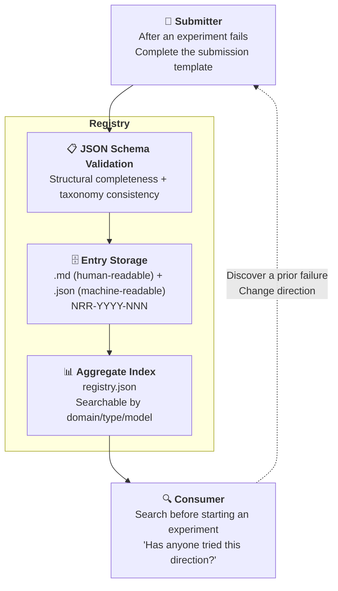

# Negative Results Registry for AI Collaboration

> **Negative Results Registry for AI Collaboration** — A structured, searchable public registry for "AI experiments that failed."

[](https://creativecommons.org/licenses/by/4.0/)
[](https://github.com/redamancy231-create/negative-results-registry/actions/workflows/ci.yml)
<!-- AUTO_GENERATED: entries_badge -->
[](https://redamancy231-create.github.io/negative-results-registry/)
<!-- AUTO_GENERATED_END -->

[](../README.md)
[](./)
[](../zh-Hant/README.md)

**Language**：English · [简体中文](../README.md) · [正體中文](../zh-Hant/README.md)

> **Knowing what doesn't work is just as important as knowing what does.** · [Browse online](https://redamancy231-create.github.io/negative-results-registry/)

---

## What This Is

The scientific community has a "file drawer problem": positive results get published, while negative results are tucked away in a drawer. The same is true in AI collaboration—GitHub is full of showcases proclaiming "I used AI to do X," but almost no one records "I tried X, and it failed."

**This registry aims to combat the "file drawer problem."** It is a structured public database, machine-queryable through `registry.json`, dedicated to documenting negative and honest results in AI collaboration. It is currently a structured prototype of the maintainer's personal failure log; it can claim community value only after external entries have been accepted.

### Core Beliefs

- **Negative results are not failures—they are data**
- **Honesty builds trust**—someone who says "all my experiments succeeded" either has never run an experiment or is lying
- **When dead ends are mapped, those who follow will not run into the same wall**
- **Precise failure conditions are more informative than vague declarations of success**
- **This is currently a structured prototype of the maintainer's personal failure log**—22 entries, one submitter, and one ecosystem. It cannot yet claim to have "combated the file drawer problem"; it needs external submissions and independent entries before it can serve as a community registry

---

## Why Me

There are 18 million AI-related repositories on GitHub, the vast majority of which are code projects—showcases proclaiming "I used AI to do X." If you want to build a new tool, framework, or model, a quick search will turn up dozens of competitors.

**But this registry is not a code project.** It is a structured set of methodological data—22 entries backed by independent review experience spanning 5 LLM backends and multiple public projects. A single project (the AI Collaboration Framework) alone accumulated 50+ rounds of independent review; add the review chains from the other projects, and the total—never tallied—far exceeds that. Every concrete number in these entries (d=0.03, n=24 per arm, 33 findings with zero overlap) is traceable to a source file and review chain. None of it was fabricated in a vacuum.

**The differentiation is not in the code—it is in the density of experience.** Someone can fork this repository, copy the schema, change the name, and ship it—but they cannot write the data that fills the entries. Code can be copied. Experience cannot.

---



---

## Taxonomy

### By Domain (12 Categories)

| Code | Domain |
|------|------|
| prompt-engineering | Prompt Engineering |
| code-review | Code Review |
| methodology-extraction | Methodology Extraction |
| workflow-orchestration | Workflow Orchestration |
| document-generation | Document Generation |
| multi-model-collaboration | Multi-Model Collaboration |
| quantitative-research | Quantitative Research |
| academic-writing | Academic Writing |
| tool-building | Tool Development |
| skill-design | Skill Design |
| benchmarking | Benchmarking |
| other | Other |

### By Negative Result Type (9 Categories)

| Code | Type |
|------|------|
| null-result | Null Result |
| ceiling-effect | Ceiling Effect |
| worse-than-baseline | Worse Than Baseline |
| failed-to-replicate | Failed to Replicate |
| methodology-failure | Methodology Failure |
| abandoned-dead-end | Abandoned Dead End |
| hypothesis-falsified | Hypothesis Falsified |
| tool-unfit-for-purpose | Tool Unfit for Purpose |
| other | Other |

> See [methodology.md §Classification System](methodology.md) for detailed descriptions.

---

## Directory Structure

```
negative-results-registry/
├── README.md                    ← You are here (trilingual: 中文 / EN / zh-Hant)
├── CONTRIBUTING.md               ← Contribution guide (trilingual)
├── CLAUDE.md                    ← AI assistant project instructions
├── LICENSE                      ← CC BY 4.0
├── .gitignore · .gitattributes
├── methodology.md               ← Taxonomy + rationale (trilingual)
├── registry.json                ← Aggregate index (script-generated, no manual edits)
│
├── .github/workflows/
│   └── ci.yml                   ← CI: Schema validation + link checks
│
├── schema/
│   └── entry.schema.json        ← Entry JSON Schema (Draft 2020-12)
│
├── templates/
│   ├── submission-v2.md         ← Submission template (recommended)
│   └── submission.md            ← Legacy template (kept for reference)
│
├── entries/                     ← 22 entries (NRR-2026-001 ~ 022)
│   └── NRR-YYYY-NNN/
│       ├── NRR-YYYY-NNN.md      ← Human-readable report
│       └── NRR-YYYY-NNN.json    ← Machine-readable data (authoritative)
│
├── scripts/
│   ├── generate_registry.py     ← entries/ → registry.json
│   ├── validate_ci.py           ← Schema + link + consistency checks
│   ├── check_external_links.py  ← External link verification
│   └── update_readme.py         ← registry.json → README auto-update
│
├── docs/
│   ├── index.html               ← GitHub Pages browsable site
│   ├── fork-modification-directions.md
│   └── existing-negative-results.md
│
├── en/                          ← English translation
├── zh-Hant/                     ← Traditional Chinese translation
└── _reviews/                    ← Independent review reports (R1 + R2)
```

---

## Submit a Negative Result

### 5-Minute Process

1. Copy `templates/submission-v2.md`
2. Fill in your negative result using the template
3. Create an entry directory (use a temporary name; the official ID will be assigned by the maintainer)
4. Add both `.md` and `.json` files (validate the JSON against `schema/entry.schema.json`)
5. Submit a Pull Request

### What Can Be Submitted?

| ✅ Welcome | ❌ Not Suitable |
|---------|----------|
| No significant difference in a controlled prompt experiment | "I just tried it and it didn't work" (no method description) |
| Methodology extraction that did not meet the stability threshold | A purely technical bug unrelated to AI collaboration |
| A tool or model that failed on a specific task | An impressionistic judgment with no record of the experimental conditions |
| A factor with no predictive power in a strategy backtest | Results from confidential or nonpublic projects |
| A pattern in workflow orchestration that had a counterproductive effect | |

### Not Required

- ❌ Academic paper format
- ❌ Statistical significance (honest single-case reports are also welcome)
- ❌ A "major failure"—even something as small as "I changed the prompt and it got worse" qualifies

---

## Entry Overview

<!-- AUTO_GENERATED: summary_line -->
The registry currently contains **22 entries** spanning 10 domains × 4 types (out of a 12-domain × 9-type schema), drawn from 7 of our own public projects + 7 external sources (academic papers + open-source projects):
<!-- AUTO_GENERATED_END -->

<!-- AUTO_GENERATED: entry_table -->
| ID | Source | Domain | Type |
|------|------|------|------|
| NRR-2026-001 | prompt-tdd-methodology | Prompt Engineering | Null Result |
| NRR-2026-002 | prompt-tdd-methodology | Prompt Engineering | Null Result |
| NRR-2026-003 | methodology-extraction-methodology | Methodology Extraction | Methodology Failure |
| NRR-2026-004 | docx-pipeline | Document Generation | Methodology Failure |
| NRR-2026-005 | etf-pattern-match-pybind11 | Tool Development | Ceiling Effect |
| NRR-2026-006 | ma-case-study-pipeline | Academic Writing | Methodology Failure |
| NRR-2026-007 | claude-skills | Skill Design | Methodology Failure |
| NRR-2026-008 | docx-pipeline | Code Review | Methodology Failure |
| NRR-2026-009 | ai-collaboration-framework | Methodology Extraction | Methodology Failure |
| NRR-2026-010 | ai-collaboration-framework | Document Generation | Methodology Failure |
| NRR-2026-011 | Kohli 2026 / CrossCheck | Multi-Model Collaboration | Ceiling Effect |
| NRR-2026-012 | ai-collaboration-framework | Methodology Extraction | Abandoned Dead End |
| NRR-2026-013 | ai-collaboration-framework | Methodology Extraction | Methodology Failure |
| NRR-2026-014 | ai-collaboration-framework | Workflow Orchestration | Methodology Failure |
| NRR-2026-015 | ai-collaboration-framework | Code Review | Methodology Failure |
| NRR-2026-016 | Kuai et al. (2026) | Multi-Model Collaboration | Ceiling Effect |
| NRR-2026-017 | Nájera et al. (2026) | Multi-Model Collaboration | Null Result |
| NRR-2026-018 | CrossCheck (sburl) | Multi-Model Collaboration | Methodology Failure |
| NRR-2026-019 | GitNexus | Benchmarking | Methodology Failure |
| NRR-2026-020 | PocketFlow | Methodology Extraction | Ceiling Effect |
| NRR-2026-021 | NPGS | Methodology Extraction | Methodology Failure |
| NRR-2026-022 | NPGS | Methodology Extraction | Methodology Failure |
<!-- AUTO_GENERATED_END -->

---

## Relationship to the Academic Literature

Papers published in 2026 have already provided external support for the academic value of negative results. See [`methodology.md`](methodology.md) §Relationship to the Academic Literature for details.

Key citation: Kohli (2026-05) demonstrated that "a panel of 9 LLMs ≈ 2 effective independent votes"—itself a negative result backed by quantitative evidence.

---

## 📂 Fork Modification Guide

**[`docs/fork-modification-directions.md`](../docs/fork-modification-directions.md)** — A comprehensive guide to all possible modification directions after forking. Includes a decision tree (3 questions to find your starting point in 30 seconds), 8 directions ranked by implementation effort, and 9 anti-patterns learned from real experience.

---

## Related Projects

- [Full Lifecycle Framework for AI Collaboration Projects](https://github.com/redamancy231-create/ai-collaboration-framework) — The methodological source for this registry
- [Prompt-TDD Methodology](https://github.com/redamancy231-create/prompt-tdd-methodology) — Source of the initial entries (A2/A3 negative results)
- [Methodology Extraction Methodology](https://github.com/redamancy231-create/methodology-extraction-methodology) — Source of the initial entries (0 patterns across 22 projects met the threshold)
- [Methodology and Lessons Learned Handbook](https://github.com/redamancy231-create/methodology-handbook) — A 50-entry error log

For more projects, see the [personal homepage](https://github.com/redamancy231-create/redamancy231-create).

---

## Known Limitations

- **Single submitter**: All 22 entries come from the same maintainer. The term "third-party analysis" in entries means the analyst is a third party **relative to the source project** (analyzing someone else's project), not that the analyst is independent of the registry maintainer — Schema V2 already distinguishes these roles via `source_authors` / `analyst` / `submitted_by`.
- **External link checks**: GitHub and arXiv domain links are skipped in CI due to platform rate limiting — evidence links on these domains require manual verification. v0.2.0 added per-entry grading (verified/skipped/broken).
- **Search capabilities**: The current site supports filtering by domain, category, and keyword (via GitHub Pages), but does not offer advanced full-text search or API export.
- **Review SLA pending**: ID allocation and evidence thresholds were finalized in v0.2.0; review response time will be set after the first external PR, estimated ≤ 1 week.

---

## License

CC BY 4.0. Entry content remains copyrighted by its submitter; submission constitutes agreement to publish it under CC BY 4.0.

---

*Generation model: DeepSeek-V4-Pro (via Claude Code CLI) · 2026-07-25*
*Translation model: GPT-5.6-Sol (via Codex CLI) · 2026-07-25*
