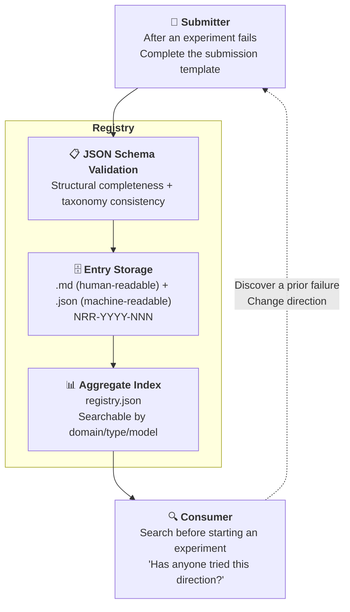

# Negative Results Registry for AI Collaboration

> **Negative Results Registry for AI Collaboration** — A structured, searchable public registry for "AI experiments that failed."

[](https://creativecommons.org/licenses/by/4.0/)
[](https://github.com/redamancy231-create/negative-results-registry/actions/workflows/ci.yml)
[]()

[](../README.md)
[](en/README.md)
[](../zh-Hant/README.md)

> **Knowing what doesn't work is just as important as knowing what does.** · [Browse online](https://redamancy231-create.github.io/negative-results-registry/)

---

## What This Is

The scientific community has a "file drawer problem": positive results get published, while negative results are tucked away in a drawer. The same is true in AI collaboration—GitHub is full of showcases proclaiming "I used AI to do X," but almost no one records "I tried X, and it failed."

**This registry aims to combat the "file drawer problem."** It is a structured public database, machine-queryable through `registry.json`, dedicated to documenting negative and honest results in AI collaboration. It is currently a structured prototype of the maintainer's personal failure log; it can claim community value only after external entries have been accepted.

### Core Beliefs

- **Negative results are not failures—they are data**
- **Honesty builds trust**—someone who says "all my experiments succeeded" either has never run an experiment or is lying
- **When dead ends are mapped, those who follow will not run into the same wall**
- **Precise failure conditions are more informative than vague declarations of success**
- **This is currently a structured prototype of the maintainer's personal failure log**—18 entries, one submitter, and one ecosystem. It cannot yet claim to have "combated the file drawer problem"; it needs external submissions and independent entries before it can serve as a community registry

---

## Why Me

There are 18 million AI-related repositories on GitHub, the vast majority of which are code projects—showcases proclaiming "I used AI to do X." If you want to build a new tool, framework, or model, a quick search will turn up dozens of competitors.

**But this registry is not a code project.** It is a structured set of methodological data—18 entries backed by independent review experience spanning 5 LLM backends and multiple public projects. A single project (the AI Collaboration Framework) alone accumulated 50+ rounds of independent review; add the review chains from the other projects, and the total—never tallied—far exceeds that. Every concrete number in these entries (d=0.03, n=24 per arm, 33 findings with zero overlap) is traceable to a source file and review chain. None of it was fabricated in a vacuum.

**The differentiation is not in the code—it is in the density of experience.** Someone can fork this repository, copy the schema, change the name, and ship it—but they cannot write the data that fills the entries. Code can be copied. Experience cannot.

---



---

## Taxonomy

### By Domain (12 Categories)

| Code | Domain |
|------|------|
| prompt-engineering | Prompt Engineering |
| code-review | Code Review |
| methodology-extraction | Methodology Extraction |
| workflow-orchestration | Workflow Orchestration |
| document-generation | Document Generation |
| multi-model-collaboration | Multi-Model Collaboration |
| quantitative-research | Quantitative Research |
| academic-writing | Academic Writing |
| tool-building | Tool Development |
| skill-design | Skill Design |
| benchmarking | Benchmarking |
| other | Other |

### By Negative Result Type (9 Categories)

| Code | Type | Description |
|------|------|------|
| null-result | Null Result | No significant difference between the experimental and control groups |
| ceiling-effect | Ceiling Effect | The baseline is already strong, leaving no room for improvement |
| worse-than-baseline | Worse Than Baseline | The new method performs worse than the baseline |
| failed-to-replicate | Failed to Replicate | A previously successful finding cannot be replicated |
| methodology-failure | Methodology Failure | The experimental design or execution itself failed |
| abandoned-dead-end | Abandoned Dead End | The direction itself is not viable |
| hypothesis-falsified | Hypothesis Falsified | The original hypothesis was explicitly disproven |
| tool-unfit-for-purpose | Tool Unfit for Purpose | The selected tool or model is unsuitable for the task |
| other | Other | |

---

## Directory Structure

```
negative-results-registry/
├── README.md                    ← You are here
├── CONTRIBUTING.md               ← Contribution guide
├── CLAUDE.md                    ← AI assistant project instructions
├── LICENSE                      ← CC BY 4.0
├── .gitignore
├── methodology.md               ← Why document negative results + detailed taxonomy
├── registry.json                ← Aggregate index (machine-readable)
│
├── schema/
│   └── entry.schema.json        ← Entry JSON Schema (Draft 2020-12)
│
├── templates/
│   └── submission.md            ← Submission template (copy and use)
│
├── entries/                     ← Entry directory
│   └── NRR-YYYY-NNN/            ← Separate directory for each entry
│       ├── NRR-YYYY-NNN.md      ← Human-readable report
│       └── NRR-YYYY-NNN.json    ← Machine-readable data
│
├── scripts/
│   └── generate_registry.py     ← Generate registry.json from entries/
│
└── docs/
    └── existing-negative-results.md  ← Inventory of our own negative results
```

---

## Submit a Negative Result

### 5-Minute Process

1. Copy `templates/submission.md`
2. Fill in your negative result using the template
3. Create the `entries/NRR-YYYY-NNN/` directory
4. Add both `.md` and `.json` files (validate the JSON against `schema/entry.schema.json`)
5. Submit a Pull Request

### What Can Be Submitted?

| ✅ Welcome | ❌ Not Suitable |
|---------|----------|
| No significant difference in a controlled prompt experiment | "I just tried it and it didn't work" (no method description) |
| Methodology extraction that did not meet the stability threshold | A purely technical bug unrelated to AI collaboration |
| A tool or model that failed on a specific task | An impressionistic judgment with no record of the experimental conditions |
| A factor with no predictive power in a strategy backtest | Results from confidential or nonpublic projects |
| A pattern in workflow orchestration that had a counterproductive effect | |

### Not Required

- ❌ Academic paper format
- ❌ Statistical significance (honest single-case reports are also welcome)
- ❌ A "major failure"—even something as small as "I changed the prompt and it got worse" qualifies

---

## Entry Overview

The registry currently contains **22 entries** spanning 9 domains × 7 types, drawn from 6 of our own public projects + 7 external sources (academic papers + open-source projects):

| ID | Source | Domain | Type |
|----|------|------|------|
| NRR-2026-001 | prompt-tdd-methodology | prompt-engineering | null-result |
| NRR-2026-002 | prompt-tdd-methodology | prompt-engineering | null-result |
| NRR-2026-003 | methodology-extraction-methodology | methodology-extraction | methodology-failure |
| NRR-2026-004 | docx-pipeline | document-generation | methodology-failure |
| NRR-2026-005 | etf-pattern-match-pybind11 | tool-building | ceiling-effect |
| NRR-2026-006 | ma-case-study-pipeline | academic-writing | methodology-failure |
| NRR-2026-007 | claude-skills | skill-design | methodology-failure |
| NRR-2026-008 | docx-pipeline | code-review | methodology-failure |
| NRR-2026-009 | ai-collaboration-framework | methodology-extraction | methodology-failure |
| NRR-2026-010 | ai-collaboration-framework | document-generation | methodology-failure |
| NRR-2026-011 | Kohli 2026 / CrossCheck | multi-model-collaboration | ceiling-effect |
| NRR-2026-012 | ai-collaboration-framework | methodology-extraction | abandoned-dead-end |
| NRR-2026-013 | ai-collaboration-framework | methodology-extraction | methodology-failure |
| NRR-2026-014 | ai-collaboration-framework | workflow-orchestration | methodology-failure |
| NRR-2026-015 | ai-collaboration-framework | code-review | methodology-failure |
| NRR-2026-016 | Kuai et al. (2026) | multi-model-collaboration | ceiling-effect |
| NRR-2026-017 | Nájera et al. (2026) | multi-model-collaboration | null-result |
| NRR-2026-018 | CrossCheck (sburl) | multi-model-collaboration | methodology-failure |
| NRR-2026-019 | GitNexus | benchmarking | methodology-failure |
| NRR-2026-020 | PocketFlow | methodology-extraction | ceiling-effect |
| NRR-2026-021 | NPGS / ml-quant-trading | methodology-extraction | methodology-failure |
| NRR-2026-022 | NPGS | methodology-extraction | methodology-failure |

---

## Relationship to the Academic Literature

Papers published in 2026 have already provided external support for the academic value of negative results. See [`methodology.md`](methodology.md) §Relationship to the Academic Literature for details.

Key citation: Kohli (2026-05) demonstrated that "a panel of 9 LLMs ≈ 2 effective independent votes"—itself a negative result backed by quantitative evidence.

---

## Related Projects

- [Full Lifecycle Framework for AI Collaboration Projects](https://github.com/redamancy231-create/ai-collaboration-framework) — The methodological source for this registry
- [Prompt-TDD Methodology](https://github.com/redamancy231-create/prompt-tdd-methodology) — Source of the initial entries (A2/A3 negative results)
- [Methodology Extraction Methodology](https://github.com/redamancy231-create/methodology-extraction-methodology) — Source of the initial entries (0 patterns across 22 projects met the threshold)
- [Methodology and Lessons Learned Handbook](https://github.com/redamancy231-create/methodology-handbook) — A 50-entry error log

For more projects, see the [personal homepage](https://github.com/redamancy231-create/redamancy231-create).

---

## License

CC BY 4.0. Entry content remains copyrighted by its submitter; submission constitutes agreement to publish it under CC BY 4.0.

---

*Generation model: DeepSeek-V4-Pro (via Claude Code CLI) · 2026-07-25*
*Translation model: GPT-5.6-Sol (via Codex CLI) · 2026-07-25*
