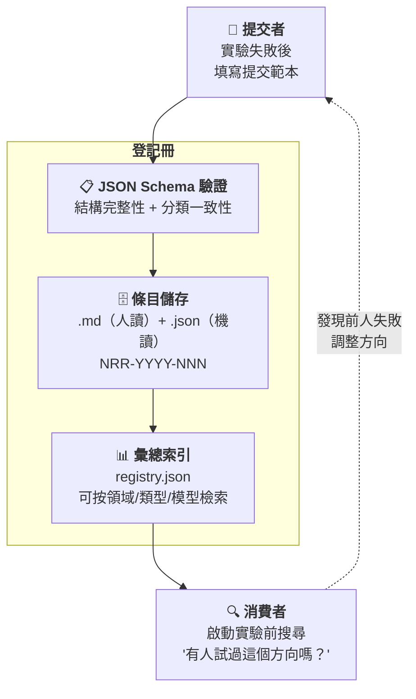

# AI 協作陰性結果登記冊

> **Negative Results Registry for AI Collaboration** — 一個結構化、可檢索的「AI 實驗失敗了」公開登記系統。

[](https://creativecommons.org/licenses/by/4.0/)
[](https://github.com/redamancy231-create/negative-results-registry/actions/workflows/ci.yml)
[]()

[](../README.md)
[](../en/README.md)
[](zh-Hant/README.md)

> **知道什麼不 work 和知道什麼 work 同等重要。** · [線上瀏覽](https://redamancy231-create.github.io/negative-results-registry/)

---

## 這是什麼

科學界有一個「檔案抽屜問題」（file drawer problem）：陽性結果發表，陰性結果塞進抽屜。AI 協作領域同樣如此——GitHub 上充斥著「我用 AI 做了 X」的展示，但幾乎沒有人記錄「我試了 X，失敗了」。

**這個登記冊旨在對抗「檔案抽屜問題」。** 它是一個結構化、可透過 `registry.json` 由機器查詢的公開資料庫，專門記錄 AI 協作中的陰性／誠實結果。目前為維護者個人失敗日誌的結構化原型，接入外部條目後方可聲稱具有社群價值。

### 核心信念

- **陰性結果不是失敗——是資料**
- **誠實建立信任**——一個說自己「所有實驗都成功」的人，要麼沒做過實驗，要麼在說謊
- **知道死胡同的位置，後來的人就不會撞牆**
- **精確的失敗條件比模糊的成功宣言更有資訊量**
- **目前為維護者個人失敗日誌的結構化原型**——18 個條目、同一提交者、同一生態系，尚不能聲稱已「對抗檔案抽屜問題」；需要外部提交和獨立條目後才能成為社群登記冊

---

## 為什麼由我來做

GitHub 上有 1,800 萬個 AI 相關倉庫，其中絕大多數是程式碼專案——「我用 AI 做了 X」的展示。製作一個新工具、新框架、新模型，你一搜尋就能找到數十個競品。

**但這個登記冊不是程式碼專案。** 它是一套結構化的方法論資料——18 個條目背後是跨 5 種 LLM 後端、涵蓋多個公開專案的獨立審查經驗。僅 AI 協作框架這一個專案就累積了 50+ 輪獨立審查，加上其他專案的審查鏈，總輪次從未統計，但遠超此數。每個條目中的具體數字（d=0.03, n=24/臂, 33 項發現 0 重疊）都有來源檔案和審查鏈可追溯，不是在真空中編造的。

**差異化不在程式碼，而在經驗密度。** 別人可以 fork 這個倉庫、複製 Schema、改個名稱發布——但寫不出條目裡的資料。程式碼可以複製，經驗不能。

---



---

## 分類體系

### 按領域（12 類）

| 代碼 | 領域 |
|------|------|
| prompt-engineering | Prompt 工程 |
| code-review | 程式碼審查 |
| methodology-extraction | 方法論提取 |
| workflow-orchestration | 工作流程編排 |
| document-generation | 檔案生成 |
| multi-model-collaboration | 多模型協作 |
| quantitative-research | 量化研究 |
| academic-writing | 學術寫作 |
| tool-building | 工具開發 |
| skill-design | Skill 設計 |
| benchmarking | 基準測試 |
| other | 其他 |

### 按陰性結果類型（9 類）

| 代碼 | 類型 | 說明 |
|------|------|------|
| null-result | 零結果 | 實驗組和對照組無顯著差異 |
| ceiling-effect | 天花板效應 | 基線已經很好，改善空間為零 |
| worse-than-baseline | 劣於基線 | 新方法比基線更差 |
| failed-to-replicate | 重現失敗 | 無法重現先前有效的發現 |
| methodology-failure | 方法失敗 | 實驗設計／執行本身出問題 |
| abandoned-dead-end | 死胡同 | 方向本身不可行 |
| hypothesis-falsified | 假設遭證偽 | 明確推翻了原有假設 |
| tool-unfit-for-purpose | 工具不適用 | 所選工具／模型不適合任務 |
| other | 其他 | |

---

## 目錄結構

```
negative-results-registry/
├── README.md                    ← 你在這裡
├── CONTRIBUTING.md               ← 貢獻指南
├── CLAUDE.md                    ← AI 助手專案指令
├── LICENSE                      ← CC BY 4.0
├── .gitignore
├── methodology.md               ← 為什麼記錄陰性結果 + 分類詳解
├── registry.json                ← 彙總索引（機器可讀）
│
├── schema/
│   └── entry.schema.json        ← 條目 JSON Schema (Draft 2020-12)
│
├── templates/
│   └── submission.md            ← 提交範本（複製即可使用）
│
├── entries/                     ← 條目目錄
│   └── NRR-YYYY-NNN/            ← 每個條目的獨立目錄
│       ├── NRR-YYYY-NNN.md      ← 人讀報告
│       └── NRR-YYYY-NNN.json    ← 機讀資料
│
├── scripts/
│   └── generate_registry.py     ← 從 entries/ 生成 registry.json
│
└── docs/
    └── existing-negative-results.md  ← 自有陰性結果盤點
```

---

## 提交一條陰性結果

### 5 分鐘流程

1. 複製 `templates/submission.md`
2. 按範本填寫你的陰性結果
3. 建立 `entries/NRR-YYYY-NNN/` 目錄
4. 放入 `.md` + `.json` 兩個檔案（JSON 按 `schema/entry.schema.json` 驗證）
5. 提交 Pull Request

### 什麼可以提交？

| ✅ 歡迎 | ❌ 不適合 |
|---------|----------|
| Prompt 對照實驗中無顯著差異 | 「我隨便試了一下不行」（缺少方法描述） |
| 方法論文獻提取未達穩定門檻 | 不涉及 AI 協作的純技術 bug |
| 某工具／模型在特定任務上失敗 | 沒有記錄實驗條件的印象式判斷 |
| 策略回測中某因子無預測力 | 保密／未公開專案的結果 |
| Workflow 編排中某模式有反效果 | |

### 不需要

- ❌ 學術論文格式
- ❌ 統計顯著性（單一案例的誠實報告也歡迎）
- ❌ 「大失敗」——小到「換了個 prompt 反而更差」也可以

---

## 條目概覽

目前已收錄 **18 個條目**，涵蓋 8 個領域 × 7 種類型，來自 6 個自有公開專案 + 4 個外部來源（3 篇學術論文 + 1 個開源專案）：

| ID | 來源 | 領域 | 類型 |
|----|------|------|------|
| NRR-2026-001 | prompt-tdd-methodology | prompt-engineering | null-result |
| NRR-2026-002 | prompt-tdd-methodology | prompt-engineering | null-result |
| NRR-2026-003 | methodology-extraction-methodology | methodology-extraction | methodology-failure |
| NRR-2026-004 | docx-pipeline | document-generation | methodology-failure |
| NRR-2026-005 | etf-pattern-match-pybind11 | tool-building | ceiling-effect |
| NRR-2026-006 | ma-case-study-pipeline | academic-writing | methodology-failure |
| NRR-2026-007 | claude-skills | skill-design | methodology-failure |
| NRR-2026-008 | docx-pipeline | code-review | methodology-failure |
| NRR-2026-009 | ai-collaboration-framework | methodology-extraction | methodology-failure |
| NRR-2026-010 | ai-collaboration-framework | document-generation | methodology-failure |
| NRR-2026-011 | Kohli 2026 / CrossCheck | multi-model-collaboration | ceiling-effect |
| NRR-2026-012 | ai-collaboration-framework | methodology-extraction | abandoned-dead-end |
| NRR-2026-013 | ai-collaboration-framework | methodology-extraction | methodology-failure |
| NRR-2026-014 | ai-collaboration-framework | workflow-orchestration | methodology-failure |
| NRR-2026-015 | ai-collaboration-framework | code-review | methodology-failure |
| NRR-2026-016 | Kuai et al. (2026) | multi-model-collaboration | ceiling-effect |
| NRR-2026-017 | Nájera et al. (2026) | multi-model-collaboration | null-result |
| NRR-2026-018 | CrossCheck (sburl) | multi-model-collaboration | methodology-failure |

---

## 與學術文獻的關係

2026 年已有論文為陰性結果的學術價值提供外部支援。詳見 [`methodology.md`](methodology.md) §與學術文獻的關係。

關鍵引用：Kohli (2026-05) 證明了「9 個 LLM 評審團 ≈ 2 個有效獨立票」——這本身就是一個具有量化證據的陰性結果。

---

## 相關專案

- [AI 協作專案全生命週期框架](https://github.com/redamancy231-create/ai-collaboration-framework) — 本登記冊的方法論來源
- [Prompt-TDD 方法論](https://github.com/redamancy231-create/prompt-tdd-methodology) — 初始條目來源（A2/A3 陰性結果）
- [方法論提取方法論](https://github.com/redamancy231-create/methodology-extraction-methodology) — 初始條目來源（22 個專案 0 個模式達標）
- [方法論與經驗教訓手冊](https://github.com/redamancy231-create/methodology-handbook) — 50 條錯題本

更多專案請見 [個人首頁](https://github.com/redamancy231-create/redamancy231-create)

---

## 授權

CC BY 4.0。條目內容的著作權歸提交者所有，提交即表示同意以 CC BY 4.0 發布。

---

*生成模型：DeepSeek-V4-Pro (via Claude Code CLI) · 2026-07-25*
*翻譯模型：GPT-5.6-Sol (via Codex CLI) · 2026-07-25*
